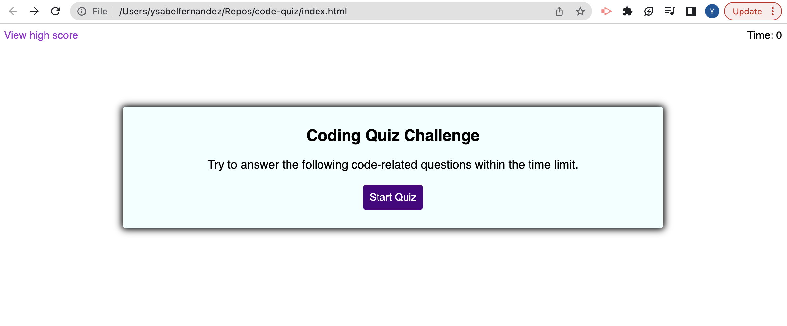

 # Code Quiz

## Description
As a coder I wanted to create a timed quiz on Javascript fundamentals. The user will begin the game, answer each question and get a score at the end. I am still working on wanting the users to save their initials and keep track of high scores.

## Visuals

## Link

## Usage
To navigate please click on the top right information you are interested in and it will take you to the section for more details. 

## License
Please refer to the LICENSE in the repo.